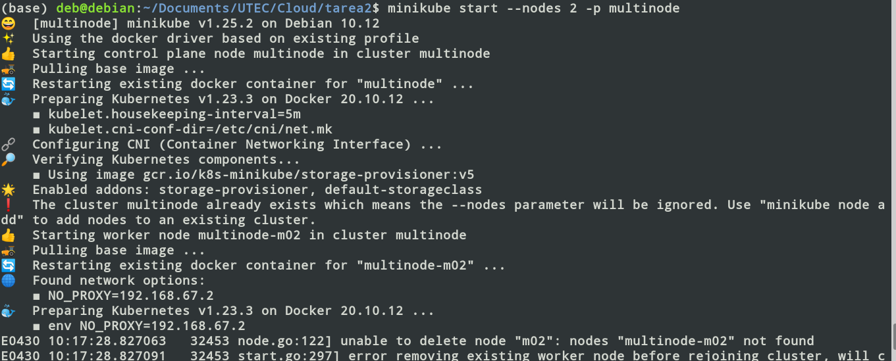
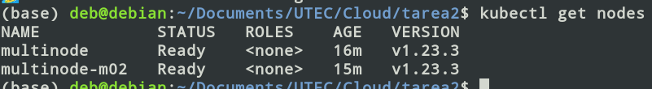
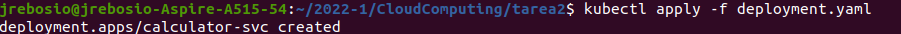
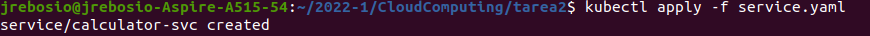
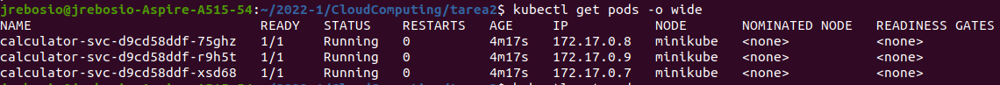
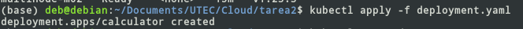
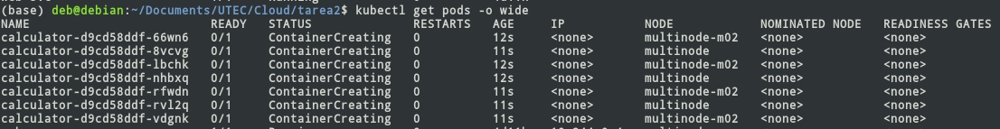

# hw2_cloud

## 1 **Deploying Kubernetes**
### 1.1. Crear un cluster kubernetes local con un único nodo (host, vm, containers)

### 1.2. Crear un cluster kubernetes local multi-nodo (host, vm, containers). Por lo menos 2 workers

## 2 **Search and select a containerized application**

### 2.1. Funcionalidad
Una calculadora que puede hacer operaciones basicas como sumar , restar, multiplicar , dividir.
### 2.2. Incluya figuras que faciliten el entendimiento de la aplicación.

## 3 **Deployment a containerized application on kubernetes**
### 3.1. Deployar la aplicación en los ambientes configurados: nodo único y multi-nodo. En el caso de multi-nodo
#### Nodo unico 

#### Multi-nodo 

### 3.2. Describir el flujo de la aplicación deployada en kubernetes.
#### Diagrama bajo nivel

#### Diagrama alto nivel

